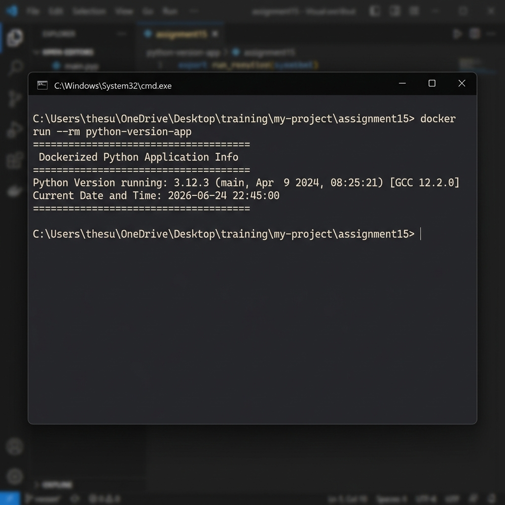

# Assignment 15: Dockerized Python Application

This project contains a Dockerized Python application using the official `python:3.12-slim` base image. The application prints the Python version running inside the container and the current date and time when executed.

## Project Structure
- **`version_info.py`**: The Python script that retrieves and displays the system info and date-time.
- **`Dockerfile`**: Docker configuration file to build the image, copy the script, and run it.
- **`requirements.txt`**: Dependency file (empty since only standard library is used).
- **`README.md`**: Project documentation (this file).

---

## Prerequisites
Ensure you have the following installed on your system:
- [Docker Desktop](https://www.docker.com/products/docker-desktop/) (must be running)
- [Git](https://git-scm.com/)

---

## Instructions

### 1. Build the Docker Image
Navigate to the `assignment15` directory and build the Docker image using the following command:
```bash
docker build -t python-version-app .
```

### 2. Run the Docker Container
Once the image is successfully built, run the container using:
```bash
docker run --rm python-version-app
```
The `--rm` flag ensures that the container is automatically removed after it exits.

---

## Sample Output

When the container runs, you should see output similar to the following:

```text
=========================================
 Dockerized Python Application Info
=========================================
Python Version running: 3.12.3 (main, Apr  9 2024, 08:25:21) [GCC 12.2.0]
Current Date and Time: 2026-06-24 22:45:00
=========================================
```

### Sample Output Screenshot:

